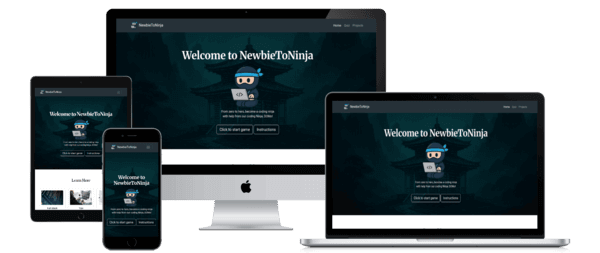
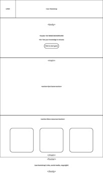
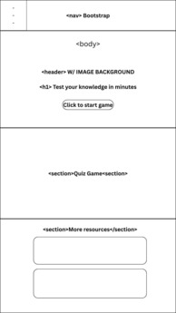
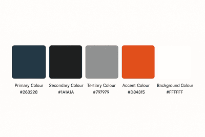
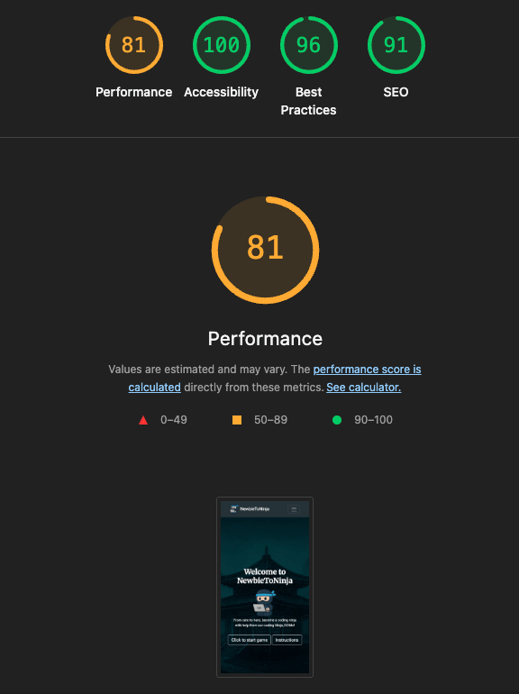

<h1>NewbieToNinja</h1>

  

## Description

<u>NewbieToNinja</u> is a website that provides information about becoming a Jr. Developer. It is primarily targeted at members of the public who are looking to start a career in tech/full-stack development. Users of the site will be able to take a quiz on the subject of full-stack development and find some little mini projects to have a go at by themselves. 
The theme of the website is based around a ninja training dojo as a place to learn and practice coding with the aid of a master (a ninja coder named DOMo).

## UX

### Layout

The site layout was created using wireframes and done in [Canva](https://canva.com/)

A minimal and clean layout was chosen to avoid any overstimulation on the understanding that neurodivergence is a common occurence within the tech community.

### Colour palette

The website uses relatively bright colours with some darker ones used for both contrast and accessibility. The aim was to keep the colour scheme as light and friendly as possible as we want users to associate positivity with their desire to learn to code.

The colour palette was selected by utilising both ChatGPT and [Coolors](https://coolors.co/). The colours were chosen for their aesthetic appeal and readability.
Colours chosen were:

- #263238 **Primary Colour - Deep blue-grey: complements coding-photo backgrounds, modern and tech-focused.**
- #1a1a1a **Secondary Colour - Near-black for strong text contrast.**
- #797979 **Tertiary Colour - Light gray for hovered buttons etc.**
- #d84315 **Accent Colour - Highlight colour, used for incorrect answers.**
- #4bad3c **Accent Colour Two - Another highlight colour, for correct messages.**
- #ffffff **Background Colour - Pure white for maximum readability.**

## Typography

Typography and Font Awesome libraries were used for typography and iconography.

Primary Font - Used for Headings.

- [Merriweather](https://fonts.google.com/specimen/Merriweather)

Secondary Font - Used for body text.

- [Roboto](https://fonts.google.com/?query=Roboto)

Font Awesome was used for icons used in the footer and elsewhere.

- [Font Awesome](https://fontawesome.com/)

## Future development

There are plans for some future development in the form of:
- Updating the Javascript in the timer to the latest version.
- Adding another two pages (already underway)
   - one to provide some tips to newbie developers
   - the other which will contain a "day in the life of a developer" where users will be able to look over the notes or annecdotes written by real developers during their day to day work.

## Tools and technologies

- [HTML](https://en.wikipedia.org/wiki/HTML) used for the main site content.
- [CSS](https://en.wikipedia.org/wiki/CSS) used for the main site design and layout.
- [JavaScript](https://www.javascript.com/) used for auto-closing the responsive burger menu.
- [Git](https://git-scm.com) used for version control. (`git add`, `git commit`, `git push`)
- [GitHub](https://github.com) used for secure online code storage.
- [GitHub Pages](https://pages.github.com) used for hosting the deployed front-end site.
- [Google Fonts](https://fonts.google.com/) used for fonts on the site.
- [Coolors](https://coolors.co/) used to generate contrasting and complementary colors

## Reflections on AI

AI such as Chat GPT and Co-pilot was utilised during the project for several functions including tutorials, generation of content and development as well as: 
- Image generation, e.g. the ‘DOMo’ character used on the website and ‘dojo artwork' in the header.
- Brand ideas for 'NewbieToNinja, including the name, colour palette and font suggestions.
- Fixing ‘crisis-point' issues, such as the timer on the quiz page which was showing issues. Co-pilot recognised the issue and provided a hot fix with very little changes to the code.
- Debugging in VS Code, finding hard to spot issues such as duplication and formatting problems.

## Testing

Testing has been completed by using:
- [GitHub Co-pilot](https://github.com/features/copilot) to assist with debugging during the coding stages. 
- [W3 validator](https://validator.w3.org/detailed.html) for validating the HTML pages
- [Jigsaw CSS validator](https://jigsaw.w3.org/css-validator/) for the CSS aspects
- [JSHint](https://jshint.com/) for validating the Javascript
   - There are some issues in JSHint with the Javascript as some of the JS was developed using references from an older version.
- The deployed project was tested with the [Lighthouse audit tool](https://developer.chrome.com/docs/lighthouse) to check for any issues. 

## Deployment

The site was deployed to GitHub Pages. The steps to deploy are as follows:

- In the [GitHub repository](https://github.com/FollowRob/Team01_Hackathon), navigate to the Settings tab
- From the source section drop-down menu, select the **Main** Branch, then click "Save".
- The page will be automatically refreshed with a detailed ribbon display to indicate the successful deployment.

The live depolyed site can be found [**Here**](https://followrob.github.io/Team01_Hackathon/)

### Local Deployment

This project can be cloned or forked in order to make a local copy on your own system.

#### Cloning

You can clone the repository by following these steps:

1. Go to the [GitHub repository](https://github.com/FollowRob/Team01_Hackathon)
2. Locate the Code button above the list of files and click it
3. Select if you prefer to clone using HTTPS, SSH, or GitHub CLI and click the copy button to copy the URL to your clipboard
4. Open Git Bash or Terminal
5. Change the current working directory to the one where you want the cloned directory
6. In your IDE Terminal, type the following command to clone my repository:
   - `git clone https://github.com/FollowRob/Team01_Hackathon.git`
7. Press Enter to create your local clone.

#### Forking

By forking the GitHub Repository, we make a copy of the original repository on our GitHub account to view and/or make changes without affecting the original owner's repository.
You can fork this repository by using the following steps:

1. Log in to GitHub and locate the [GitHub Repository](https://github.com/FollowRob/Team01_Hackathon)
2. At the top of the Repository (not top of page) just above the "Settings" Button on the menu, locate the "Fork" Button.
3. Once clicked, you should now have a copy of the original repository in your own GitHub account!

## Contributors

### Team # 1

| Participant   | Description                                                                                                                                            |
| ------------- | ------------------------------------------------------------------------------------------------------------------------------------------------------ |
| Mamta Oli     | <ul><li>[GitHub Profile](https://github.com/Futurevision108)</li></ul>                                                                                 |
| Sean Matthews | <ul><li>[GitHub Profile](https://github.com/SeanMatthews26)</li><li>[LinkedIn Profile](https://www.linkedin.com/in/sean-matthews-6b085a27a/)</li></ul> |
| Michael Owen  | <ul><li>[GitHub Profile](https://github.com/michael311087)</li></ul>                                                                                   |
| Alex Riley    | <ul><li>[GitHub Profile](https://github.com/alexjriley)</li><li>[LinkedIn Profile](https://www.linkedin.com/in/digitalar/)</li></ul>                   |
| Rob Smith     | <ul><li>[GitHub Profile](https://github.com/FollowRob)</li><li>[LinkedIn Profile](https://www.linkedin.com/in/robjamessmith/)</li></ul>                |

## Resources

- [ChatGPT](https://chatgpt.com/)
- [GitHub Co-pilot](https://github.com/features/copilot)
- [Coolors](https://coolors.co/)
- [W3 Schools](https://www.w3schools.com/)
- [freeCodeCamp](https://www.freecodecamp.org/)
- [Readme example - Kera Cudmore](https://github.com/kera-cudmore/readme-examples?tab=readme-ov-file)
- [Readme example - Lewis Dillon](https://github.com/LewisMDillon/Bushy-Park-Social-Tennis/blob/main/README.md)
- [Trello](https://trello.com/)
- [Live Blogger Youtube Channel](https://www.youtube.com/@LiveBlogger/videos)
- [Funy Coder  Youtube Channel](https://www.youtube.com/@funycoder) 